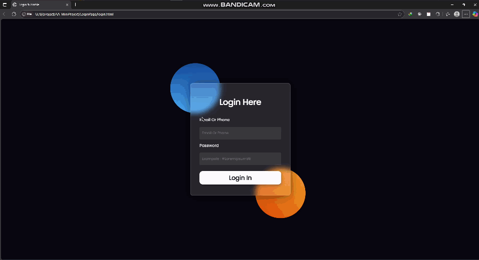

# پروژه Login Page با افکت‌های مدرن ✨

<div align="center">  </div>

## ویژگی‌های کلیدی 🌟

- طراحی مدرن با افکت شیشه‌ای (Glassmorphism) 🪟
- انیمیشن‌های نرم و روان برای تعامل کاربر 🎭
- طراحی ریسپانسیو برای تمام دستگاه‌ها 📱💻
- افکت‌های گرادیان دایره‌ای در پس‌زمینه 🔵🟠
- افکت بلور (blur) برای عمق بخشیدن به طراحی 🔮

## تکنولوژی‌های استفاده شده 🛠️

- HTML5
- CSS3 (با افکت‌های مدرن)
- Flexbox برای چیدمان
- Media Queries برای ریسپانسیو

## استیکرهای استفاده شده در پروژه 🎨

1. **Glassmorphism Effect** 🥃 - برای فرم لاگین
2. **Gradient Circles** 🔴🔵 - دو دایره رنگی در پس‌زمینه
3. **Smooth Transitions** 🌀 - برای hover effects
4. **3D Rotation** 🔄 - برای آیکون پروفایل
5. **Neon Shadow** 💡 - برای سایه‌های زیبا

## راهنمای نصب 📥

1. کلون کردن ریپازیتوری:
   ```bash
   git clone https://github.com/developer-iko-mike/loginUi.git

   cd loginUi
   start index.html
   ```

2. باز کردن فایل index.html در مرورگر

## ویژگی‌های قابل توسعه 🚀

- [ ] افزودن سیستم احراز هویت واقعی
- [ ] پیاده‌سازی حالت تاریک/روشن 🌓
- [ ] اضافه کردن امکان ورود با شبکه‌های اجتماعی
- [ ] افزودن انیمیشن‌های بیشتر با GSAP

## نمونه کد جذاب از پروژه 💻

```css
.profile:hover img {
  transform: rotate(180deg);
}

.shape--one {
  background: linear-gradient(#0D47A1, #42A5F5);
}

form {
  backdrop-filter: blur(10px);
}
```

## نکات طراحی 🎯

- استفاده از رنگ‌های متضاد برای خوانایی بهتر
- افکت‌های hover روان برای تجربه کاربری بهتر
- سایه‌های ملایم برای ایجاد عمق
- ترنزیشن‌های زمان‌بندی شده برای انیمیشن‌ها

## توسعه‌دهندگان 👩💻👨💻

- Mohammadiko - طراحی و پیاده‌سازی

---

**🌟 از این پروژه لذت ببرید و ستاره بدید! 🌟**
